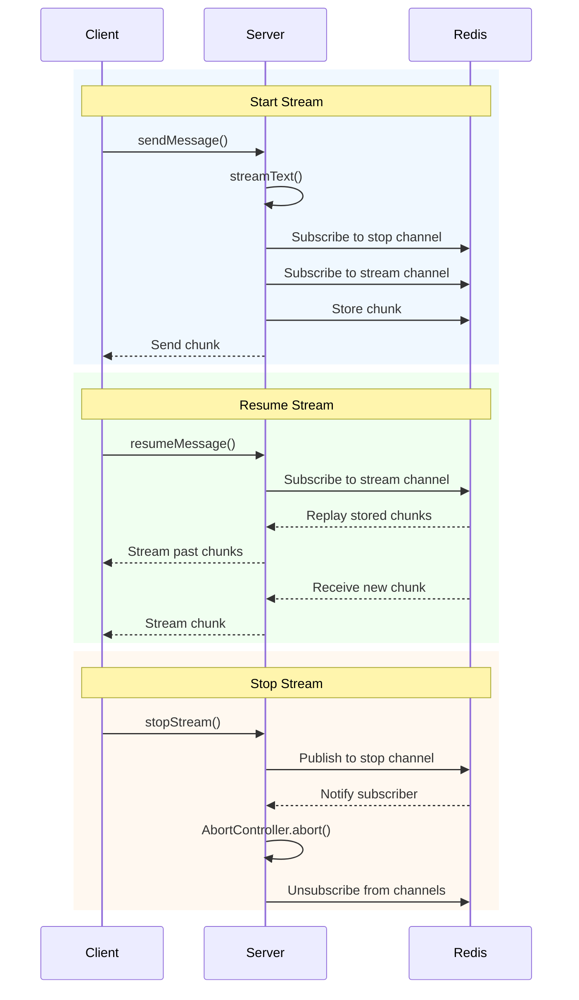

<div align='center'>

# ai-resumable-stream

<p align="center">AI SDK: Resume and stop UI message streams</p>
<p align="center">
  <a href="https://www.npmjs.com/package/ai-resumable-stream" alt="ai-resumable-stream"></a> <a href="https://github.com/zirkelc/ai-resumable-stream/actions/workflows/ci.yml" alt="CI"></a>
</p>

</div>

This library provides resumable streaming for UI message streams created by [`streamText()`](https://ai-sdk.dev/docs/reference/ai-sdk-core/stream-text) in the AI SDK. It uses Redis to persist stream data, allowing clients to resume interrupted streams or stop active streams from anywhere.

**Why?**

Streams are ephemeral — once data flows through, it's gone. This creates two hard problems:

**Resume is hard** because the server doesn't track what's been sent. If a client disconnects (network issue, page reload, tab switch), the stream keeps running on the server but the client loses all that data. When reconnecting, there's no way to replay missed chunks without persisting them somewhere.

**Stop is hard** because the client requesting "stop" isn't the same request that started the stream. The user clicks "Stop generating", which fires a new HTTP request, but the original stream is running in a different request/process. Without a central coordination point, you can't signal across requests.

This library implements resumable streams with Redis to support both:

- **Resuming**: Chunks are stored as they arrive, enabling replay on reconnect
- **Stopping**: Stop signals are broadcast to any process running the stream

## How It Works



## Installation

This library requires a Redis client.

```bash
npm install ai-resumable-stream redis
```

## Usage

The library requires two Redis clients (pub/sub needs separate connections). The clients will connect automatically, if not already connected, but the library won't disconnect them afterwards. That means you can manage the connection lifecycle in your application and reuse clients across multiple streams.

```typescript
import { createClient } from "redis";
import { createResumableUIMessageStream } from "ai-resumable-stream";

const publisher = createClient({ url: process.env.REDIS_URL });
const subscriber = createClient({ url: process.env.REDIS_URL });

// Optional: connect clients immediately or let the library connect on demand
await publisher.connect();
await subscriber.connect();

const context = await createResumableUIMessageStream({
  streamId: `stream-123`,
  publisher,
  subscriber,
});
```

### `startStream`

Start a new stream and persist chunks to Redis. Returns a client stream that can be consumed immediately.

> ![TIP]
> The stream returned by `startStream` is both a readable stream and an async iterable.
> That means you can use `return stream` or `yield* stream`.

```typescript
import { streamText } from "ai";

async function sendMessage() {
  // Optional: create AbortController to enable stopStream
  const abortController = new AbortController();

  // Create resumable stream context
  const context = await createResumableUIMessageStream({
    streamId: `stream-123`,
    publisher,
    subscriber,
    abortController,
  });

  const result = streamText({
    model: `gpt-4o`,
    prompt: `Tell me a story`,
    // Optional: pass abort signal to enable stopping
    abortSignal: abortController.signal,
  });

  // Start streaming - chunks are stored in Redis as they arrive
  const stream = await context.startStream(result.toUIMessageStream());

  // Return stream to client
  return stream;
}
```

### `resumeStream`

Resume an existing stream from Redis. Returns all past chunks followed by any remaining chunks, or `null` if no active stream exists.

> ![TIP]
> The stream returned by `resumeStream` is both a readable stream and an async iterable.
> That means you can use `return stream` or `yield* stream`.

```typescript
async function resumeMessage() {
  // Create resumable stream context
  const context = await createResumableUIMessageStream({
    streamId: `stream-123`,
    publisher,
    subscriber,
  });

  // Try to resume an existing stream
  const stream = await context.resumeStream();

  // If no stream exists, return early
  if (!stream) {
    console.log("No active stream to resume");
    return;
  }

  // Return resumed stream to client
  return stream;
}
```

### `stopStream`

Stop an active stream from any client. Requires an `AbortController` to be passed when creating the context.

```typescript
async function stopMessage() {
  const context = await createResumableUIMessageStream({
    streamId: `stream-123`,
    publisher,
    subscriber,
  });

  await context.stopStream();
}
```

## Examples

### tRPC

Server-side tRPC procedures for sending, resuming, and stopping streams:

```typescript
// server/router.ts
import { z } from "zod";
import { streamText, type UIMessage, type UIMessageChunk } from "ai";
import { createClient } from "redis";
import { createResumableUIMessageStream } from "ai-resumable-stream";
import { publicProcedure, router } from "./trpc";

const publisher = createClient({ url: process.env.REDIS_URL });
const subscriber = createClient({ url: process.env.REDIS_URL });

export const appRouter = router({
  sendMessage: publicProcedure
    .input(z.object({ chatId: z.string(), message: z.custom<UIMessage>() }))
    .mutation(async function* ({ input }): AsyncGenerator<UIMessageChunk> {
      const { chatId, message } = input;

      // TODO: Generate and save active stream ID for the chat
      const activeStreamId = randomUUID();
      await saveChat({ chatId, activeStreamId });

      const abortController = new AbortController();

      const context = await createResumableUIMessageStream({
        streamId: activeStreamId,
        publisher,
        subscriber,
        abortController,
      });

      const result = streamText({
        model: openai("gpt-4o"),
        messages: [message],
        abortSignal: abortController.signal,
        onFinish: async () => {
          // TODO: Clear the active stream when finished
          await saveChat({ chatId, activeStreamId: null });
        },
      });

      const stream = await context.startStream(result.toUIMessageStream());

      yield* stream;
    }),

  resumeMessage: publicProcedure.input(z.object({ chatId: z.string() })).mutation(async function* ({
    input,
  }): AsyncGenerator<UIMessageChunk> {
    const { chatId } = input;

    // TODO: Get active stream ID for the chat
    const { activeStreamId } = await getChat(chatId);

    const context = await createResumableUIMessageStream({
      streamId: activeStreamId,
      publisher,
      subscriber,
    });

    const stream = await context.resumeStream();
    if (!stream) return;

    yield* stream;
  }),

  stopStream: publicProcedure
    .input(z.object({ chatId: z.string() }))
    .mutation(async ({ input }) => {
      const { chatId } = input;

      // TODO: Get active stream ID for the chat
      const { activeStreamId } = await getChat(chatId);

      const context = await createResumableUIMessageStream({
        streamId: activeStreamId,
        publisher,
        subscriber,
      });

      await context.stopStream();

      return { success: true };
    }),
});
```

## Configuration

### Options

| Option            | Type                         | Required | Description                                                    |
| ----------------- | ---------------------------- | -------- | -------------------------------------------------------------- |
| `streamId`        | `string`                     | Yes      | Unique identifier for the stream                               |
| `publisher`       | `Redis`                      | Yes      | Redis client for publishing                                    |
| `subscriber`      | `Redis`                      | Yes      | Redis client for subscribing (must be separate from publisher) |
| `abortController` | `AbortController`            | No       | Controller to enable `stopStream` functionality                |
| `waitUntil`       | `(promise: Promise) => void` | No       | Keep serverless function alive until stream completes          |

### Redis Connection

The library automatically connects Redis clients if they're not already connected. Clients are **not** disconnected after stream completion.

```typescript
// Clients can be connected or disconnected
const publisher = createClient({ url: redisUrl });
const subscriber = createClient({ url: redisUrl });

// Library connects if needed
const context = await createResumableUIMessageStream({
  streamId: "stream-123",
  publisher, // Will connect if not already connected
  subscriber, // Will connect if not already connected
});

// Manage disconnection yourself when appropriate
await publisher.quit();
await subscriber.quit();
```

## API Reference

### `createResumableUIMessageStream`

```typescript
async function createResumableUIMessageStream(options: CreateResumableUIMessageStream): Promise<{
  startStream: (
    stream: ReadableStream<UIMessageChunk>,
  ) => Promise<AsyncIterableStream<UIMessageChunk>>;
  resumeStream: () => Promise<AsyncIterableStream<UIMessageChunk> | null>;
  stopStream: () => Promise<void>;
}>;

type CreateResumableUIMessageStream = {
  streamId: string;
  publisher: Redis;
  subscriber: Redis;
  abortController?: AbortController;
  waitUntil?: (promise: Promise<unknown>) => void;
};
```

### Return Values

#### `startStream`

```typescript
async function startStream(
  stream: ReadableStream<UIMessageChunk>,
): Promise<AsyncIterableStream<UIMessageChunk>>;
```

Starts a new resumable stream. The input stream is tee'd—one branch goes to the client, the other is persisted to Redis.

#### `resumeStream`

```typescript
async function resumeStream(): Promise<AsyncIterableStream<UIMessageChunk> | null>;
```

Resumes an existing stream. Returns `null` if:

- No stream exists for the given `streamId`
- The stream has already completed
- The stream TTL has expired

#### `stopStream`

```typescript
async function stopStream(): Promise<void>;
```

Publishes a stop message via Redis pub/sub. If an `abortController` was provided during creation, the stream's `AbortController.abort()` is called, ending the stream with an `abort` chunk.
