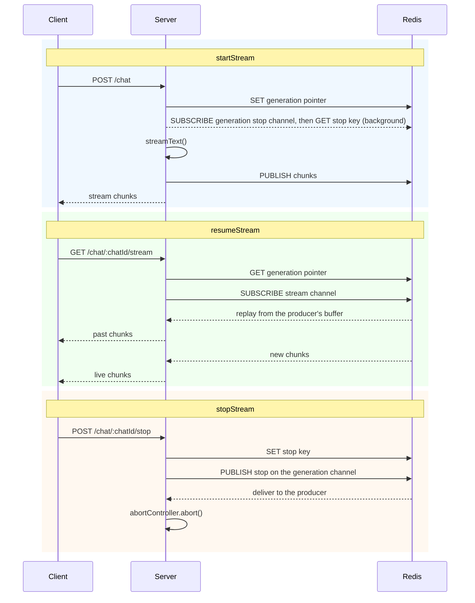
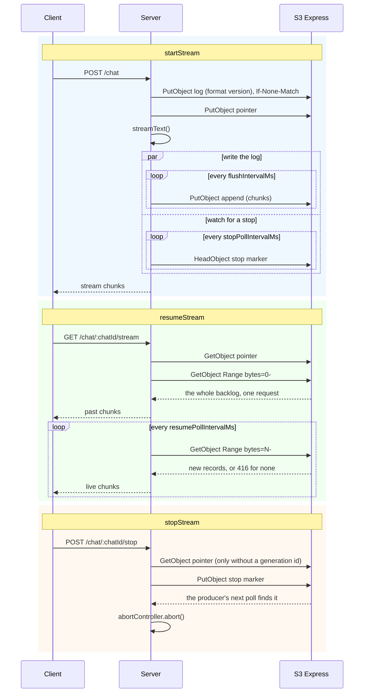

<div align='center'>

# ai-resumable-stream

<p align="center">AI SDK: Resume and stop UI message streams</p>
<p align="center">
  <a href="https://www.npmjs.com/package/ai-resumable-stream" alt="ai-resumable-stream"></a> <a href="https://github.com/zirkelc/ai-resumable-stream/actions/workflows/ci.yml" alt="CI"></a>
</p>

</div>

This library provides resumable streaming for UI message streams created by [`streamText()`](https://ai-sdk.dev/docs/reference/ai-sdk-core/stream-text) in the AI SDK. Chunks are persisted as they are produced, allowing clients to resume interrupted streams or stop active streams from anywhere.

Where the chunks go is your choice. Two adapters ship; a third is four methods.

**Why?**

Streams are ephemeral. Once data flows through, it is gone. That creates two hard problems.

**Resume is hard** because the server does not track what it has sent. A client that disconnects (network drop, page reload, tab switch) loses everything that arrived while it was away, while the stream keeps running on the server. When reconnecting, there's no way to replay missed chunks without persisting them somewhere.

**Stop is hard** because the client requesting "stop" is not the request that started the stream. The user clicks "Stop generating", which fires a new HTTP request, but the original stream is running in a different request/process. Without a central coordination point, you can't signal across requests.

## Install

```sh
npm install ai-resumable-stream
```

Optional peer dependencies, one per feature you use:

| Package              | Needed for                                |
| -------------------- | ----------------------------------------- |
| `redis`              | `ai-resumable-stream/adapters/redis`      |
| `@aws-sdk/client-s3` | `ai-resumable-stream/adapters/s3-express` |
| `ai`                 | `ai-resumable-stream/ai-sdk`              |

> [!NOTE]
> Version compatibility:
>
> - Use [`ai-resumable-stream@1.x`](https://github.com/zirkelc/ai-resumable-stream/tree/v1.x) for AI SDK v6
> - Use [`ai-resumable-stream@2.x`](https://github.com/zirkelc/ai-resumable-stream/tree/v2.x) and later for AI SDK v7

## Quick start

Create one context and reuse it for every stream.

```ts
import { createClient } from "redis";
import { createRedisAdapter } from "ai-resumable-stream/adapters/redis";
import { createResumableUIMessageStream } from "ai-resumable-stream/ai-sdk";

const publisher = createClient({ url: process.env.REDIS_URL });
const subscriber = createClient({ url: process.env.REDIS_URL });

// Optional: connect clients immediately or let the library connect on demand
await publisher.connect();
await subscriber.connect();

const context = createResumableUIMessageStream({
  adapter: createRedisAdapter({ publisher, subscriber }),
});
```

Then wire three routes.

```ts
// POST /chat/:chatId
const { stream } = await context.startStream(toUIMessageStream({ stream: result.stream }), {
  streamId: chatId,
});
return stream;

// GET /chat/:chatId/stream
const stream = await context.resumeStream({ streamId: chatId });
return stream ?? new Response(null, { status: 204 });

// POST /chat/:chatId/stop
await context.stopStream({ streamId: chatId });
```

## Usage

### `startStream`

Starts a stream and persists chunks as they are produced. Returns the stream for the client that started it, the id the stream was registered under, and the id of this generation.

> [!TIP]
> The returned stream is both a `ReadableStream` and an async iterable, so `return stream` and `yield* stream` both work.

```ts
import { streamText, toUIMessageStream } from "ai";

async function sendMessage(chatId: string, messages: UIMessage[]) {
  // Optional: lets `streamText` see the stop signal
  const abortController = new AbortController();

  const result = streamText({
    model: openai(`gpt-4o`),
    messages,
    abortSignal: abortController.signal,
  });

  const { stream } = await context.startStream(toUIMessageStream({ stream: result.stream }), {
    // Optional: generates a stream id if not supplied
    streamId: chatId,
    abortController,
  });

  // Return stream to client
  return stream;
}
```

| Option                    | Type                          | Description                                                                                                                                                           |
| ------------------------- | ----------------------------- | --------------------------------------------------------------------------------------------------------------------------------------------------------------------- |
| `streamId`                | `string`                      | Defaults to a generated id, returned as `streamId`                                                                                                                    |
| `generationId`            | `string`                      | Identifies this generation, so it can be resumed and stopped on its own. Must not be in use for the stream id. Defaults to a generated id, returned as `generationId` |
| `abortController`         | `AbortController`             | Created if not supplied                                                                                                                                               |
| `onStopSubscriptionError` | `(error: unknown) => void`    | Called when listening for stops fails. The stream continues, but cannot be stopped                                                                                    |
| `onFinish`                | `() => void \| Promise<void>` | Runs once the source has ended, on every exit path including errors and stops. Errors are ignored                                                                     |

#### Abort controller

A generation is stoppable whether or not you pass an `abortController`, because one is created when you do not.

```ts
// Without an abortController: stopping cancels the source, which propagates upstream
await streams.startStream(toUIMessageStream({ stream: result.stream }), { streamId });

// With abortController: `streamText` sees the signal
const abortController = new AbortController();
const result = streamText({ model, messages, abortSignal: abortController.signal });
await streams.startStream(toUIMessageStream({ stream: result.stream }), {
  streamId,
  abortController,
});
```

Pass your own `abortController` to hand the signal to `streamText`. That aborts the provider request directly and lets the AI SDK emit its `abort` chunk and run `onAbort`, instead of relying on cancellation travelling back up the pipe.

### `resumeStream`

Resume an existing stream and replays every chunk produced so far, then follows the rest live. Pass `generationId` to resume one generation; omit it to resume the generation the stream id currently points at. Returns `null` when there is nothing to resume.

```ts
async function resumeMessage(chatId: string) {
  const stream = await context.resumeStream({ streamId: chatId });

  // If no stream exists, return early
  if (!stream) {
    console.log("No active stream to resume");
    return;
  }

  // Return resumed stream to client
  return stream;
}
```

The stream is `null` in three cases that are deliberately indistinguishable:

- no stream was ever started under that id
- the stream already completed
- the producer died or was stopped part way through

If your application needs to tell a truncated stream from a complete one, record that next to the message you persist.

### `stopStream`

Stop a stream that is still producing. Pass `generationId` to stop one generation; omit it to stop the generation the stream id points at.

```ts
async function stopMessage(chatId: string, messageId?: string) {
  await streams.stopStream({ streamId: chatId, generationId: messageId });
}
```

A stop for a generation id may arrive before that generation listens for it, or before it starts. Both shipped adapters keep the request for the generation, so it is stopped as soon as it listens. A stop without a generation id is resolved against the current generation at request time; with no current generation, nothing is kept and the stop has no effect.

See [Identifiers](#identifiers) for which generation a stop reaches.

## Identifiers

Two ids address a stream.

| Id             | Names                            | Default                                   |
| -------------- | -------------------------------- | ----------------------------------------- |
| `streamId`     | the stream, across generations   | a generated id, returned by `startStream` |
| `generationId` | one generation of that stream id | a generated id, returned by `startStream` |

A generation is one run of a stream id. A stream id points at one generation at a time: each call to `startStream` creates a generation and moves the pointer to it.

### Stream ID

A stream id points at the generation that started last, and addressing the stream id reaches that generation.

```
startStream({ streamId: "chat-1" })   -> generation A
startStream({ streamId: "chat-1" })   -> generation B

  chat-1 ──▶ generation B              the pointer moved to the newest generation

  resumeStream({ streamId: "chat-1" })  ──▶ generation B
  stopStream({ streamId: "chat-1" })    ──▶ generation B

  generation A keeps producing and persisting, but nothing addresses it
```

Pass the chat id in most applications. It allows at most one addressable stream per chat, and a reconnecting client calls `resumeStream({ streamId: chatId })` with the id it already has. Omit it to get a generated id.

Starting a stream under an id already in use moves the pointer. A resume then returns the new generation and none of the old one's chunks, and a producer that is still shutting down cannot tear down the generation that replaced it.

### Stream ID and Generation ID

A generation id addresses one generation, whatever the pointer names. Pass an id the client already holds, such as the id of the user message it sent, and the client addresses that generation without learning a server-generated id.

```
startStream({ streamId: "chat-1", generationId: "msg-1" })   -> generation msg-1
startStream({ streamId: "chat-1", generationId: "msg-2" })   -> generation msg-2

  chat-1 ──▶ msg-2                     the pointer still moves to the newest generation
             msg-1                     the older generation keeps its own address

  resumeStream({ streamId: "chat-1" })                        ──▶ msg-2
  resumeStream({ streamId: "chat-1", generationId: "msg-1" }) ──▶ msg-1
  stopStream({ streamId: "chat-1", generationId: "msg-1" })   ──▶ msg-1
```

```ts
// POST /chat/:chatId (the client sends the id of its user message)
const { stream } = await streams.startStream(toUIMessageStream({ stream: result.stream }), {
  streamId: chatId,
  generationId: messageId,
  abortController,
});

// GET /chat/:chatId/stream?messageId=...
const stream = await streams.resumeStream({ streamId: chatId, generationId: messageId });

// POST /chat/:chatId/stop
await streams.stopStream({ streamId: chatId, generationId: messageId });
```

Use it when generations of one stream id overlap: one client stops a generation while another generation of the same id is already starting, and a stop for the old one must not reach the new one.

**Resume.** `resumeStream({ streamId })` follows the generation the stream id points at. `resumeStream({ streamId, generationId })` follows that generation, even after a newer one moved the pointer. It returns `null` once the generation can no longer be resumed.

**Stop.** `stopStream({ streamId, generationId })` stops that generation, and never a newer generation of the same stream id. `stopStream({ streamId })` stops the generation the stream id points at when the request is made.

> [!WARNING]
> A generation id names one generation, for good. Starting a second generation under an id an earlier one used, a retry of the same message included, breaks both of them in the Redis adapter: both producers answer the same resume requests, the first one to end makes the other unresumable, and one stop reaches both. The S3 Express adapter refuses the second start with `ObjectExistsError`. The library does not check this for you.

## Adapters

| Import                                    | Store                                                                       |
| ----------------------------------------- | --------------------------------------------------------------------------- |
| `ai-resumable-stream/adapters/redis`      | Redis, via [`resumable-stream`](https://github.com/vercel/resumable-stream) |
| `ai-resumable-stream/adapters/s3-express` | One appendable object per stream, in an S3 Express One Zone bucket          |

### Redis

This adapter requires two Redis clients (pub/sub needs separate connections). Both `redis` v5 and v6 are supported. The clients will be connected automatically, if not already connected, but the library won't disconnect them afterwards. That means you can manage the connection lifecycle in your application and reuse clients across multiple streams.

```ts
import { createClient } from "redis";
import { createRedisAdapter } from "ai-resumable-stream/adapters/redis";
import { createResumableUIMessageStream } from "ai-resumable-stream/ai-sdk";

const publisher = createClient({ url: process.env.REDIS_URL });
const subscriber = createClient({ url: process.env.REDIS_URL });

const adapter = createRedisAdapter({ publisher, subscriber });

const context = createResumableUIMessageStream({
  adapter,
});
```

| Option       | Type          | Required | Description                                                         |
| ------------ | ------------- | -------- | ------------------------------------------------------------------- |
| `publisher`  | `RedisClient` | Yes      | Issues commands                                                     |
| `subscriber` | `RedisClient` | Yes      | Must be separate: a subscribed connection cannot issue commands     |
| `keyPrefix`  | `string`      | No       | Namespaces every key and channel. Defaults to `ai-resumable-stream` |

#### How it works

This adapter is built on [`resumable-stream`](https://github.com/vercel/resumable-stream). Chunks are never stored in Redis itself. They live in the memory of the process that produces them and reach late subscribers over pub/sub, so Redis carries the signalling and a small pointer per stream, not the messages. There is no chunk retention to configure.

Each stream id points at one generation. That pointer carries a 24 hour expiry so a producer that dies without cleaning up leaves nothing behind for long. Starting a new stream under an id that is already in use moves the pointer to a fresh generation, so a producer that is still shutting down cannot tear down the stream that replaced it. The pointer is deleted as soon as the source ends, but only while it still names that generation, which is why a resume request arriving during teardown is told there is nothing to resume instead of racing it.

A resume with a generation id skips the pointer and asks for that generation directly, so it works after a newer generation moved the pointer, for as long as the producer of that generation is alive.

Stop requests travel on a pub/sub channel per generation. A producer subscribes to the channel of its own generation when the stream starts, and aborts its controller when a message arrives, no matter which process published it. Because each generation has its own channel, ending one never removes the listener of another on the shared subscriber connection.

Pub/sub keeps nothing, so a stop published before the producer subscribed would be lost. The adapter therefore also stores the stop: `stopStream` first sets a stop key for the generation (with a one hour expiry), then publishes. The producer first subscribes, then reads the key. Every stop is either delivered to the subscription or found in the key, whatever the order. A stop without a generation id is stored under the generation the pointer names at that moment; with no current generation, nothing is stored.

A generation deletes its stop key when it ends, together with the pointer, so a stop does not outlive the generation it was meant for. The expiry then covers only a stop for a generation that never ran, or one whose producer died before it could clean up.

> [!IMPORTANT]
> **A stream is only resumable while its producer is alive.**


```mermaid
sequenceDiagram
    participant Client
    participant Server
    participant Redis

    rect rgb(240, 248, 255)
        Note over Client,Redis: startStream
        Client->>Server: POST /chat
        Server->>Redis: SET generation pointer
        Server-->>Redis: SUBSCRIBE generation stop channel, then GET stop key (background)
        Server->>Server: streamText()
        Server->>Redis: PUBLISH chunks
        Server-->>Client: stream chunks
    end

    rect rgb(240, 255, 240)
        Note over Client,Redis: resumeStream
        Client->>Server: GET /chat/:chatId/stream
        Server->>Redis: GET generation pointer
        Server->>Redis: SUBSCRIBE stream channel
        Redis-->>Server: replay from the producer's buffer
        Server-->>Client: past chunks
        Redis-->>Server: new chunks
        Server-->>Client: live chunks
    end

    rect rgb(255, 248, 240)
        Note over Client,Redis: stopStream
        Client->>Server: POST /chat/:chatId/stop
        Server->>Redis: SET stop key
        Server->>Redis: PUBLISH stop on the generation channel
        Redis-->>Server: deliver to the producer
        Server->>Server: abortController.abort()
    end
```

### S3 Express

This adapter requires an [S3 Express One Zone](https://docs.aws.amazon.com/AmazonS3/latest/userguide/s3-express-one-zone.html) directory bucket and an `S3Client` that you build yourself, so credentials, region and retry behaviour stay with your application.

Chunks are held in the bucket rather than in the memory of the process producing them. A resume is served by reading the object, so it does not depend on the producing process answering, and any instance with access to the bucket can serve it.

```ts
import { S3Client } from "@aws-sdk/client-s3";
import { createS3ExpressAdapter } from "ai-resumable-stream/adapters/s3-express";

const adapter = createS3ExpressAdapter({
  client: new S3Client({ region: `us-east-1` }),
  bucket: `my-streams--use1-az4--x-s3`,
});
```

| Option                 | Type       | Default               | Description                                                                   |
| ---------------------- | ---------- | --------------------- | ----------------------------------------------------------------------------- |
| `client`               | `S3Client` |                       | Built and configured by you                                                   |
| `bucket`               | `string`   |                       | A directory bucket in an Availability Zone                                    |
| `prefix`               | `string`   | `ai-resumable-stream` | Namespaces every key. Point the lifecycle rule at it                          |
| `flushIntervalMs`      | `number`   | `250`                 | How long chunks may sit in memory before being written                        |
| `batchSize`            | `number`   | `50`                  | Forces a write once this many chunks are buffered                             |
| `resumePollIntervalMs` | `number`   | `500`                 | How often a resuming reader looks for new bytes                               |
| `stopPollIntervalMs`   | `number`   | `1000`                | How often a producer checks for a stop request                                |
| `heartbeatMs`          | `number`   | `5000`                | How often an idle producer records that it is alive                           |
| `deadAfterMs`          | `number`   | `30000`               | Silence after which a producer is presumed dead. At least twice `heartbeatMs` |

#### How it works

A stream is one object in the bucket, appended to as chunks are produced. Chunks are buffered in memory and written once `batchSize` of them have collected or `flushIntervalMs` has passed, whichever comes first, so a stream costs one request per flush rather than one per chunk.

Each stream id points at one generation, and the pointer is a small object next to the log. Every key the adapter writes sits under the generation, the stop marker included. A producer that has been superseded therefore cannot append into the log of the stream that replaced it, and a stop request cannot reach a generation other than the one it was resolved against.

Stop requests are an object too. `stopStream` writes a marker under the generation it names, or under the generation the pointer names when it names none, and the producer checks for it every `stopPollIntervalMs` and aborts its controller when it appears. The marker stays in the bucket, so a stop written before its run started is found once the run starts.

A caller-supplied generation id is URL-encoded into one path segment, like the stream id. It must not be empty, `.`, `..` or `current`, since the pointer object already uses that name.

The first object of a generation's log is created with a conditional write (`If-None-Match: *`), so a generation id whose log already exists fails with `ObjectExistsError` instead of overwriting a log another producer is still appending to. A resume with a generation id skips the pointer and reads that generation's log directly.

> [!IMPORTANT]
> The bucket must be an [S3 Express One Zone](https://docs.aws.amazon.com/AmazonS3/latest/userguide/s3-express-one-zone.html) directory bucket in an Availability Zone. Appends exist nowhere else in S3, and they are what make a stream one object rather than one object per batch.

**How a stream is stored.** One appendable object, holding chunks, liveness and completion in the same log. A resuming reader replays the whole backlog in a single ranged read, then follows the tail at one request per poll.

```
{prefix}/{streamId}/current                pointer to the generation that started last
{prefix}/{streamId}/{generationId}/0       the log
{prefix}/{streamId}/{generationId}/stop    stop marker
```


```mermaid
sequenceDiagram
    participant Client
    participant Server
    participant S3 as S3 Express

    rect rgb(240, 248, 255)
        Note over Client,S3: startStream
        Client->>Server: POST /chat
        Server->>S3: PutObject log (format version), If-None-Match
        Server->>S3: PutObject pointer
        Server->>Server: streamText()
        par write the log
            loop every flushIntervalMs
                Server->>S3: PutObject append (chunks)
            end
        and watch for a stop
            loop every stopPollIntervalMs
                Server->>S3: HeadObject stop marker
            end
        end
        Server-->>Client: stream chunks
    end

    rect rgb(240, 255, 240)
        Note over Client,S3: resumeStream
        Client->>Server: GET /chat/:chatId/stream
        Server->>S3: GetObject pointer
        Server->>S3: GetObject Range bytes=0-
        S3-->>Server: the whole backlog, one request
        Server-->>Client: past chunks
        loop every resumePollIntervalMs
            Server->>S3: GetObject Range bytes=N-
            S3-->>Server: new records, or 416 for none
            Server-->>Client: live chunks
        end
    end

    rect rgb(255, 248, 240)
        Note over Client,S3: stopStream
        Client->>Server: POST /chat/:chatId/stop
        Server->>S3: GetObject pointer (only without a generation id)
        Server->>S3: PutObject stop marker
        S3-->>Server: the producer's next poll finds it
        Server->>Server: abortController.abort()
    end
```

Every flush is one billed `PutObject`, and that is where the cost of a stream sits. Raising `flushIntervalMs` reduces the number of writes in proportion, and adds the same amount to how far behind a resuming reader runs. Reads are charged at a much lower rate. Run the producer in the same Availability Zone as the bucket, since AWS documents access from another zone as slower.

A producer with nothing to write records a heartbeat every `heartbeatMs`, and both ends judge liveness on S3's clock rather than the caller's. A log that has not been written to for `deadAfterMs` is treated as having a dead producer, so `resumeStream` returns `null` and a reader already following it ends.

Nothing is deleted when a stream finishes, because a reader may still be draining it. Set a [lifecycle expiration rule](https://docs.aws.amazon.com/AmazonS3/latest/userguide/directory-buckets-objects-lifecycle.html) on the bucket covering `prefix`.

> [!WARNING]
> Lifecycle on a directory bucket does nothing unless the bucket policy grants `s3express:CreateSession` with `ReadWrite` to `lifecycle.s3.amazonaws.com`. Without it, objects accumulate silently.

No local emulator implements appends, so the tests run against an in-memory bucket. To check that model against the real thing:

```sh
S3_EXPRESS_BUCKET=my-streams--use1-az4--x-s3 AWS_REGION=us-east-1 pnpm test integration
```

### Custom `StreamAdapter`

A `StreamAdapter` is four methods. Implement them against the store you want and pass the object as `adapter`.

```ts
import type { StreamAdapter } from "ai-resumable-stream";

const adapter: StreamAdapter = {
  createStream({ streamId, generationId, chunks, waitUntil }) { ... },
  resumeStream({ streamId, generationId }) { ... },
  requestStop({ streamId, generationId }) { ... },
  onStopRequested({ streamId, generationId, onStop }) { ... },
};
```

| Method            | Contract                                                                                                                                                                                                          |
| ----------------- | ----------------------------------------------------------------------------------------------------------------------------------------------------------------------------------------------------------------- |
| `createStream`    | Discards any state left from a previous stream with the same id, points the id at `generationId`, consumes `chunks` in the background. Resolves once resumable, not once complete                                 |
| `resumeStream`    | Chunks already produced, then those still to come, of the generation `generationId` names, or of the generation the stream id points at when omitted. `null` when unknown, finished, or expired                   |
| `requestStop`     | Stops the generation `generationId` names, or the generation the stream id points at when omitted. Safe to call for an unknown or finished stream. Should keep the request if the generation is not listening yet |
| `onStopRequested` | Producer-side listener for one generation. Reports a stop kept from before it registered. Returns a function that removes this listener and no other                                                              |

`createStream` receives a `ReadableStream<string>` of encoded chunks. It has to consume that stream in the background until it ends, and `resumeStream` has to return the same strings in the same order, followed by the ones still to come. The strings are opaque, so any framing they need to survive your store is the adapter's own concern.

`requestStop` and `onStopRequested` usually run in different processes, so the stop signal has to travel through the store as well, by a subscription, a poll, or whatever the backend offers. Key it by generation, so a stop never reaches another generation of the same stream id. `onStopRequested` is never awaited by `startStream`, and a rejection only means that run cannot be stopped.

The tests in [`src/__tests__/conformance-suite.ts`](./src/__tests__/conformance-suite.ts) run against both shipped adapters and cover what an adapter has to get right: replay followed by live chunks on resume, persistence that continues after the client disconnects, a reused id that discards the previous stream's chunks, a stop that reaches a reader who resumed, a stop that reaches only the generation it names, including one requested before that generation started, and a resume of an older generation while a newer one is current.

## Advanced

### Chunk types

The root export is generic over the chunk type and has no dependency on `ai`. The `ai-sdk` subpath binds it to the AI SDK:

```ts
import { createResumableUIMessageStream } from "ai-resumable-stream/ai-sdk";

const streams = createResumableUIMessageStream({ adapter });
```

That is exactly `createResumableStream({ adapter, codec: uiMessageChunkCodec })`. Chunks are validated on the way back, so one written by an older version of your application is dropped rather than failing the resume.

For anything else, supply a `StreamCodec`:

```ts
import { createResumableStream, type StreamCodec } from "ai-resumable-stream";

const codec: StreamCodec<MyChunk> = {
  encode: (chunk) => JSON.stringify(chunk),
  decode: (data) => JSON.parse(data) as MyChunk,
};

const streams = createResumableStream({ adapter, codec });
```

`decode` may return `undefined` to drop a chunk it cannot represent, so one bad chunk never fails an entire resume.

### Serverless

Persistence outlives the response, so the runtime has to be told to wait for it:

```ts
import { waitUntil } from "@vercel/functions";

const streams = createResumableUIMessageStream({ adapter, waitUntil });
```

### Finish

The `onFinish` callback is invoked after the source stream has ended and the adapter stream was closed. Use it for cleanup tasks like removing the active stream ID from the database. Errors thrown by `onFinish` are silently caught.

```typescript
const stream = await context.startStream(toUIMessageStream({ stream: result.stream }), {
  onFinish: async () => {
    await saveChat({ chatId, activeStreamId: null });
  },
});
```

## Examples

Two runnable demos live in [`examples/`](./examples), one per adapter. Each starts a stream, disconnects the client part way through, resumes it by id, and then stops a second stream from elsewhere.

```sh
pnpm example:redis        # a throwaway Redis, started for you
pnpm example:s3-express   # an in-memory bucket, since no emulator implements appends
```

### tRPC

Server-side procedures for sending, resuming, and stopping. The chat id is the stream id, so no active-stream pointer has to be stored or cleared.

```ts
// server/router.ts
import { z } from "zod";
import { streamText, toUIMessageStream, type UIMessage, type UIMessageChunk } from "ai";
import { createClient } from "redis";
import { createResumableUIMessageStream } from "ai-resumable-stream/ai-sdk";
import { createRedisAdapter } from "ai-resumable-stream/adapters/redis";
import { publicProcedure, router } from "./trpc";

const publisher = createClient({ url: process.env.REDIS_URL });
const subscriber = createClient({ url: process.env.REDIS_URL });

const streams = createResumableUIMessageStream({
  adapter: createRedisAdapter({ publisher, subscriber }),
});

export const appRouter = router({
  sendMessage: publicProcedure
    .input(z.object({ chatId: z.string(), message: z.custom<UIMessage>() }))
    .mutation(async function* ({ input }): AsyncGenerator<UIMessageChunk> {
      const { chatId, message } = input;

      const abortController = new AbortController();

      const result = streamText({
        model: openai(`gpt-4o`),
        messages: [message],
        abortSignal: abortController.signal,
      });

      const { stream } = await streams.startStream(toUIMessageStream({ stream: result.stream }), {
        streamId: chatId,
        abortController,
        onFinish: async () => {
          await saveAssistantMessage(chatId, await result.text);
        },
      });

      yield* stream;
    }),

  resumeMessage: publicProcedure.input(z.object({ chatId: z.string() })).mutation(async function* ({
    input,
  }): AsyncGenerator<UIMessageChunk> {
    const stream = await streams.resumeStream({ streamId: input.chatId });
    if (!stream) return;

    yield* stream;
  }),

  stopMessage: publicProcedure
    .input(z.object({ chatId: z.string() }))
    .mutation(async ({ input }) => {
      await streams.stopStream({ streamId: input.chatId });

      return { success: true };
    }),
});
```

## API Reference

### `createResumableStream`

```ts
function createResumableStream<CHUNK>(options: CreateResumableStreamOptions<CHUNK>): {
  startStream: (
    source: ReadableStream<CHUNK>,
    options?: StartStreamOptions,
  ) => Promise<StartStreamResult<CHUNK>>;
  resumeStream: (options: ResumeStreamOptions) => Promise<AsyncIterableStream<CHUNK> | null>;
  stopStream: (options: StopStreamOptions) => Promise<void>;
};

type CreateResumableStreamOptions<CHUNK> = {
  adapter: StreamAdapter;
  codec: StreamCodec<CHUNK>;
  waitUntil?: (promise: Promise<unknown>) => void;
  generateId?: () => string;
};

type StartStreamOptions = {
  streamId?: string;
  generationId?: string;
  abortController?: AbortController;
  onStopSubscriptionError?: (error: unknown) => void;
  onFinish?: () => void | Promise<void>;
};

type StartStreamResult<CHUNK> = {
  streamId: string;
  generationId: string;
  stream: AsyncIterableStream<CHUNK>;
};

type ResumeStreamOptions = {
  streamId: string;
  generationId?: string;
};

type StopStreamOptions = {
  streamId: string;
  generationId?: string;
};
```

| Option       | Type                 | Required | Description                                                                                                                                     |
| ------------ | -------------------- | -------- | ----------------------------------------------------------------------------------------------------------------------------------------------- |
| `adapter`    | `StreamAdapter`      | Yes      | Where chunks are stored and how stop requests travel                                                                                            |
| `codec`      | `StreamCodec<CHUNK>` | Yes      | Translates between chunks and the strings an adapter stores                                                                                     |
| `waitUntil`  | `(promise) => void`  | No       | Keeps the host process alive until persistence finishes. Omit on long-lived servers                                                             |
| `generateId` | `() => string`       | No       | Generates a stream id or a generation id when `startStream` is not given one. Must return a fresh id each call. Defaults to `crypto.randomUUID` |

### `createResumableUIMessageStream`

The same, with `codec` fixed to `uiMessageChunkCodec`.

```ts
function createResumableUIMessageStream(
  options: Omit<CreateResumableStreamOptions<UIMessageChunk>, `codec`>,
): { startStream; resumeStream; stopStream };
```

### `StreamAdapter`

```ts
type StreamAdapter = {
  createStream(options: {
    streamId: string;
    generationId: string;
    chunks: ReadableStream<string>;
    waitUntil?: (promise: Promise<unknown>) => void;
  }): Promise<void>;
  resumeStream(options: {
    streamId: string;
    generationId?: string;
  }): Promise<ReadableStream<string> | null>;
  requestStop(options: { streamId: string; generationId?: string }): Promise<void>;
  onStopRequested(options: {
    streamId: string;
    generationId: string;
    onStop: () => void;
  }): Promise<() => void>;
};
```

### `StreamCodec`

```ts
type StreamCodec<CHUNK> = {
  encode(chunk: CHUNK): string;
  decode(data: string): CHUNK | undefined | Promise<CHUNK | undefined>;
};
```

## License

MIT
