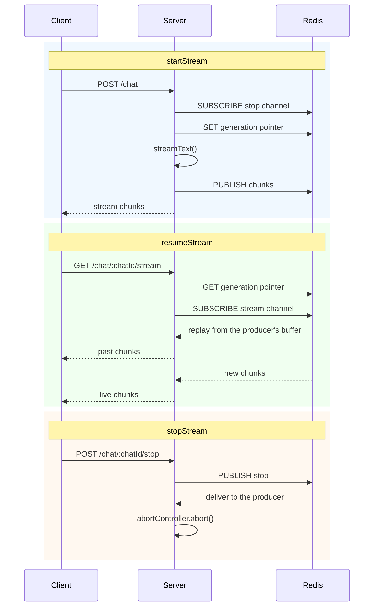
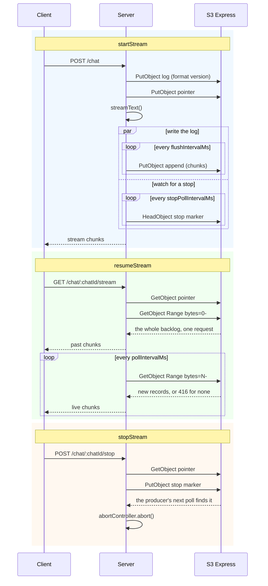

<div align='center'>

# ai-resumable-stream

<p align="center">Resume and stop AI SDK streams, backed by S3, Redis, or any store you provide</p>
<p align="center">
  <a href="https://www.npmjs.com/package/ai-resumable-stream" alt="ai-resumable-stream"></a> <a href="https://github.com/zirkelc/ai-resumable-stream/actions/workflows/ci.yml" alt="CI"></a>
</p>

</div>

Resumable and stoppable streams for [`streamText()`](https://ai-sdk.dev/docs/reference/ai-sdk-core/stream-text). Chunks are persisted as they are produced, so a client that disconnects can pick the stream up again, and a stop request from any process reaches the one producing it.

Where the chunks go is your choice. Two adapters ship; a third is four methods.

**Why?**

Streams are ephemeral. Once data flows through, it is gone. That creates two hard problems.

**Resume is hard.** The server does not track what it has sent. A client that disconnects (network drop, page reload, tab switch) loses everything that arrived while it was away, while the stream keeps running on the server.

**Stop is hard.** The request that says "stop" is not the request that started the stream. Without a coordination point, one cannot signal the other.

## Install

```sh
npm install ai-resumable-stream
```

Optional peer dependencies, one per feature you use:

| Package              | Needed for                                |
| -------------------- | ----------------------------------------- |
| `redis`              | `ai-resumable-stream/adapters/redis`      |
| `@aws-sdk/client-s3` | `ai-resumable-stream/adapters/s3-express` |
| `ai`                 | `ai-resumable-stream/ai-sdk`              |

## Quick start

Create one context and reuse it for every stream.

```ts
import { createResumableUIMessageStream } from "ai-resumable-stream/ai-sdk";
import { createRedisAdapter } from "ai-resumable-stream/adapters/redis";

export const streams = createResumableUIMessageStream({
  adapter: createRedisAdapter({ publisher, subscriber }),
});
```

Then wire three routes.

```ts
/** POST /chat */
const { stream } = await streams.startStream(result.toUIMessageStream(), { streamId: chatId });
return stream;

/** GET /chat/:chatId/stream */
const stream = await streams.resumeStream(chatId);
return stream ?? new Response(null, { status: 204 });

/** POST /chat/:chatId/stop */
await streams.stopStream(chatId);
```

That is the whole API.

## Usage

### `startStream`

Starts a stream and persists chunks as they are produced. Returns the stream for the client that started it, plus the id it was registered under.

One drain loop feeds both the client and the adapter. **Cancelling the client stream does not stop persistence**, so a disconnected client can still resume.

> [!TIP]
> The returned stream is both a `ReadableStream` and an async iterable, so `return stream` and `yield* stream` both work.

```ts
import { streamText } from "ai";

async function sendMessage(chatId: string, messages: UIMessage[]) {
  /** Optional, but preferred. Lets `streamText` see the stop signal. */
  const abortController = new AbortController();

  const result = streamText({
    model: openai(`gpt-4o`),
    messages,
    abortSignal: abortController.signal,
  });

  const { stream } = await streams.startStream(result.toUIMessageStream(), {
    streamId: chatId,
    abortController,
    onFinish: async () => {
      await saveAssistantMessage(chatId, await result.text);
    },
  });

  return stream;
}
```

| Option            | Type                          | Description                                                                                       |
| ----------------- | ----------------------------- | ------------------------------------------------------------------------------------------------- |
| `streamId`        | `string`                      | Defaults to a generated id, returned as `streamId`                                                |
| `abortController` | `AbortController`             | Created if not supplied, so a stream is always stoppable                                          |
| `onFinish`        | `() => void \| Promise<void>` | Runs once the source has ended, on every exit path including errors and stops. Errors are ignored |

### `resumeStream`

Replays every chunk produced so far, then follows the rest live. Returns `null` when there is nothing to resume.

```ts
async function resumeMessage(chatId: string) {
  const stream = await streams.resumeStream(chatId);

  /** Unknown, already finished, or its producer died. */
  if (!stream) return null;

  return stream;
}
```

`null` covers three cases, deliberately indistinguishable:

- no stream was ever started under that id
- the stream completed
- the producer died or was stopped part way through

If your application needs to tell a truncated stream from a complete one, record that next to the message you persist in `onFinish`.

### `stopStream`

Asks the producing process to stop, from anywhere. Resolves once the request is recorded, which may be before the producer has seen it.

```ts
async function stopMessage(chatId: string) {
  await streams.stopStream(chatId);
}
```

## Stream ids

A stream is addressed by one `streamId` that you choose. There is no second pointer or key to maintain.

- **Pass the chat id** in most applications. It encodes "at most one active stream per chat", and a reconnecting client needs nothing else to call `resumeStream(chatId)`.
- **Pass the assistant message id** when you need to address one specific stream.
- **Reusing an id is safe.** Starting a new stream under an existing id discards the previous stream's chunks, and a producer still shutting down cannot corrupt or terminate the stream that replaced it.
- **Omit it** and one is generated. `startStream` returns it.

## Stopping

Stop is always wired. It needs no extra configuration.

```ts
/** Without a controller. Stopping cancels the source, which propagates upstream. */
await streams.startStream(result.toUIMessageStream(), { streamId });

/** With one, so `streamText` sees the signal. Preferred. */
const abortController = new AbortController();
const result = streamText({ model, messages, abortSignal: abortController.signal });
await streams.startStream(result.toUIMessageStream(), { streamId, abortController });
```

Both stop the stream. Pass your own controller anyway: handing the signal to `streamText` aborts the provider request directly and lets the AI SDK emit its `abort` chunk and run `onAbort`, instead of relying on cancellation travelling back up the pipe.

## Adapters

| Import                                    | Store                                                                       | Survives the producer |
| ----------------------------------------- | --------------------------------------------------------------------------- | --------------------- |
| `ai-resumable-stream/adapters/redis`      | Redis, via [`resumable-stream`](https://github.com/vercel/resumable-stream) | No                    |
| `ai-resumable-stream/adapters/s3-express` | One appendable object per stream, in an S3 Express One Zone bucket          | Yes                   |

**A finished stream keeps its chunks.** A reader that started while it was live may still be draining them, so wiping on completion would truncate its message.

### Redis

```ts
import { createClient } from "redis";
import { createRedisAdapter } from "ai-resumable-stream/adapters/redis";

const publisher = createClient({ url: process.env.REDIS_URL });
const subscriber = createClient({ url: process.env.REDIS_URL });

const adapter = createRedisAdapter({ publisher, subscriber });
```

| Option       | Type          | Required | Description                                                         |
| ------------ | ------------- | -------- | ------------------------------------------------------------------- |
| `publisher`  | `RedisClient` | Yes      | Issues commands                                                     |
| `subscriber` | `RedisClient` | Yes      | Must be separate: a subscribed connection cannot issue commands     |
| `keyPrefix`  | `string`      | No       | Namespaces every key and channel. Defaults to `ai-resumable-stream` |

Both clients are connected on first use and never disconnected, so you keep the connection lifecycle and reuse them across streams.

Chunks live in the memory of the producing process and reach late subscribers over pub/sub. Nothing is retained in Redis itself, so there is no TTL to configure.

> [!IMPORTANT]
> **A stream is only resumable while its producer is alive.** If a stream must survive the process that started it, use the S3 Express adapter.


```mermaid
sequenceDiagram
    participant Client
    participant Server
    participant Redis

    rect rgb(240, 248, 255)
        Note over Client,Redis: startStream
        Client->>Server: POST /chat
        Server->>Redis: SUBSCRIBE stop channel
        Server->>Redis: SET generation pointer
        Server->>Server: streamText()
        Server->>Redis: PUBLISH chunks
        Server-->>Client: stream chunks
    end

    rect rgb(240, 255, 240)
        Note over Client,Redis: resumeStream
        Client->>Server: GET /chat/:chatId/stream
        Server->>Redis: GET generation pointer
        Server->>Redis: SUBSCRIBE stream channel
        Redis-->>Server: replay from the producer's buffer
        Server-->>Client: past chunks
        Redis-->>Server: new chunks
        Server-->>Client: live chunks
    end

    rect rgb(255, 248, 240)
        Note over Client,Redis: stopStream
        Client->>Server: POST /chat/:chatId/stop
        Server->>Redis: PUBLISH stop
        Redis-->>Server: deliver to the producer
        Server->>Server: abortController.abort()
    end
```

### S3 Express

A bucket is the only dependency. No Redis, no database, nothing to run.

```ts
import { S3Client } from "@aws-sdk/client-s3";
import { createS3ExpressAdapter } from "ai-resumable-stream/adapters/s3-express";

const adapter = createS3ExpressAdapter({
  client: new S3Client({ region: `us-east-1` }),
  bucket: `my-streams--use1-az4--x-s3`,
});
```

| Option               | Type       | Default               | Description                                            |
| -------------------- | ---------- | --------------------- | ------------------------------------------------------ |
| `client`             | `S3Client` |                       | Built and configured by you                            |
| `bucket`             | `string`   |                       | A directory bucket in an Availability Zone             |
| `prefix`             | `string`   | `ai-resumable-stream` | Namespaces every key. Point the lifecycle rule at it   |
| `flushIntervalMs`    | `number`   | `250`                 | How long chunks may sit in memory before being written |
| `batchSize`          | `number`   | `50`                  | Forces a write once this many chunks are buffered      |
| `pollIntervalMs`     | `number`   | `500`                 | How often a resuming reader looks for new bytes        |
| `stopPollIntervalMs` | `number`   | `1000`                | How often a producer checks for a stop request         |
| `heartbeatMs`        | `number`   | `5000`                | How often an idle producer records that it is alive    |
| `deadAfterMs`        | `number`   | `30000`               | Silence after which a producer is presumed dead        |

> [!IMPORTANT]
> The bucket must be an [S3 Express One Zone](https://docs.aws.amazon.com/AmazonS3/latest/userguide/s3-express-one-zone.html) directory bucket in an Availability Zone. Appends exist nowhere else in S3, and they are what make a stream one object rather than one object per batch.

**How a stream is stored.** One appendable object, holding chunks, liveness and completion in the same log. A resuming reader replays the whole backlog in a single ranged read, then follows the tail at one request per poll.

```
{prefix}/{streamId}/current                pointer to the current generation
{prefix}/{streamId}/{generationId}/0       the log
{prefix}/{streamId}/{generationId}/stop    stop marker
```


```mermaid
sequenceDiagram
    participant Client
    participant Server
    participant S3 as S3 Express

    rect rgb(240, 248, 255)
        Note over Client,S3: startStream
        Client->>Server: POST /chat
        Server->>S3: PutObject log (format version)
        Server->>S3: PutObject pointer
        Server->>Server: streamText()
        par write the log
            loop every flushIntervalMs
                Server->>S3: PutObject append (chunks)
            end
        and watch for a stop
            loop every stopPollIntervalMs
                Server->>S3: HeadObject stop marker
            end
        end
        Server-->>Client: stream chunks
    end

    rect rgb(240, 255, 240)
        Note over Client,S3: resumeStream
        Client->>Server: GET /chat/:chatId/stream
        Server->>S3: GetObject pointer
        Server->>S3: GetObject Range bytes=0-
        S3-->>Server: the whole backlog, one request
        Server-->>Client: past chunks
        loop every pollIntervalMs
            Server->>S3: GetObject Range bytes=N-
            S3-->>Server: new records, or 416 for none
            Server-->>Client: live chunks
        end
    end

    rect rgb(255, 248, 240)
        Note over Client,S3: stopStream
        Client->>Server: POST /chat/:chatId/stop
        Server->>S3: GetObject pointer
        Server->>S3: PutObject stop marker
        S3-->>Server: the producer's next poll finds it
        Server->>Server: abortController.abort()
    end
```

**Cost.** Writes are what you pay for. Every flush is one billed `PutObject`, so `flushIntervalMs` is the dial: doubling it roughly halves what a stream costs and adds that much to how far a resuming reader lags. Reads are close to free. Put the producer in the bucket's Availability Zone, since AWS is explicit that reaching a directory bucket from another one is slower.

**Liveness** is judged on S3's clock at both ends, never the caller's. An idle producer records that it is alive every `heartbeatMs`. A log unwritten for `deadAfterMs` has a dead producer, so `resumeStream` returns `null` and a reader already following it ends.

**Cleanup is yours.** Nothing is deleted when a stream finishes. Give the bucket a [lifecycle expiration rule](https://docs.aws.amazon.com/AmazonS3/latest/userguide/directory-buckets-objects-lifecycle.html) covering `prefix`.

> [!WARNING]
> Lifecycle on a directory bucket does nothing unless the bucket policy grants `s3express:CreateSession` with `ReadWrite` to `lifecycle.s3.amazonaws.com`. Without it, objects accumulate silently.

**Versioning.** Each log declares a format version in its first bytes. A reader refuses a log written by a version of this package it does not understand, rather than misreading it. That matters during a rolling deploy, when two versions can meet the same stream.

No local emulator implements appends, so the tests run against an in-memory bucket. To check that model against the real thing:

```sh
S3_EXPRESS_BUCKET=my-streams--use1-az4--x-s3 AWS_REGION=us-east-1 pnpm test integration
```

### Custom `StreamAdapter`

To put streams anywhere else, implement four methods. Both adapters above are built this way.

```ts
import type { StreamAdapter } from "ai-resumable-stream";

const adapter: StreamAdapter = {
  createStream(streamId, chunks, context) { ... },
  resumeStream(streamId) { ... },
  requestStop(streamId) { ... },
  onStopRequested(streamId, onStop) { ... },
};
```

| Method            | Contract                                                                                                                                                           |
| ----------------- | ------------------------------------------------------------------------------------------------------------------------------------------------------------------ |
| `createStream`    | Discards any state left from a previous stream with the same id, registers the id, consumes `chunks` in the background. Resolves once resumable, not once complete |
| `resumeStream`    | Chunks already produced, then those still to come. `null` when unknown, finished, or expired                                                                       |
| `requestStop`     | Safe to call for an unknown or finished stream                                                                                                                     |
| `onStopRequested` | Producer-side listener. Returns a function that removes it                                                                                                         |

Chunks are transported as opaque strings and their order must be preserved. Any framing needed to survive the transport is the adapter's own concern.

## Chunk types

The root export is generic over the chunk type and has no dependency on `ai`. The `ai-sdk` subpath binds it to the AI SDK:

```ts
import { createResumableUIMessageStream } from "ai-resumable-stream/ai-sdk";

const streams = createResumableUIMessageStream({ adapter });
```

That is exactly `createResumableStream({ adapter, codec: uiMessageChunkCodec })`. Chunks are validated on the way back, so one written by an older version of your application is dropped rather than failing the resume.

For anything else, supply a `StreamCodec`:

```ts
import { createResumableStream, type StreamCodec } from "ai-resumable-stream";

const codec: StreamCodec<MyChunk> = {
  encode: (chunk) => JSON.stringify(chunk),
  decode: (data) => JSON.parse(data) as MyChunk,
};

const streams = createResumableStream({ adapter, codec });
```

`decode` may return `undefined` to drop a chunk it cannot represent, so one bad chunk never fails an entire resume.

## Serverless

Persistence outlives the response, so the runtime has to be told to wait for it:

```ts
import { waitUntil } from "@vercel/functions";

const streams = createResumableUIMessageStream({ adapter, waitUntil });
```

## Examples

Two runnable demos live in [`examples/`](./examples), one per adapter. Each starts a stream, disconnects the client part way through, resumes it by id, and then stops a second stream from elsewhere.

```sh
pnpm example:redis        # a throwaway Redis, started for you
pnpm example:s3-express   # an in-memory bucket, since no emulator implements appends
```

### tRPC

Server-side procedures for sending, resuming, and stopping. The chat id is the stream id, so no active-stream pointer has to be stored or cleared.

```ts
// server/router.ts
import { z } from "zod";
import { streamText, type UIMessage, type UIMessageChunk } from "ai";
import { createClient } from "redis";
import { createResumableUIMessageStream } from "ai-resumable-stream/ai-sdk";
import { createRedisAdapter } from "ai-resumable-stream/adapters/redis";
import { publicProcedure, router } from "./trpc";

const publisher = createClient({ url: process.env.REDIS_URL });
const subscriber = createClient({ url: process.env.REDIS_URL });

const streams = createResumableUIMessageStream({
  adapter: createRedisAdapter({ publisher, subscriber }),
});

export const appRouter = router({
  sendMessage: publicProcedure
    .input(z.object({ chatId: z.string(), message: z.custom<UIMessage>() }))
    .mutation(async function* ({ input }): AsyncGenerator<UIMessageChunk> {
      const { chatId, message } = input;

      const abortController = new AbortController();

      const result = streamText({
        model: openai(`gpt-4o`),
        messages: [message],
        abortSignal: abortController.signal,
      });

      const { stream } = await streams.startStream(result.toUIMessageStream(), {
        streamId: chatId,
        abortController,
        onFinish: async () => {
          await saveAssistantMessage(chatId, await result.text);
        },
      });

      yield* stream;
    }),

  resumeMessage: publicProcedure.input(z.object({ chatId: z.string() })).mutation(async function* ({
    input,
  }): AsyncGenerator<UIMessageChunk> {
    const stream = await streams.resumeStream(input.chatId);
    if (!stream) return;

    yield* stream;
  }),

  stopMessage: publicProcedure
    .input(z.object({ chatId: z.string() }))
    .mutation(async ({ input }) => {
      await streams.stopStream(input.chatId);

      return { success: true };
    }),
});
```

## API Reference

### `createResumableStream`

```ts
function createResumableStream<CHUNK>(options: CreateResumableStreamOptions<CHUNK>): {
  startStream: (
    source: ReadableStream<CHUNK>,
    options?: StartStreamOptions,
  ) => Promise<{ streamId: string; stream: AsyncIterableStream<CHUNK> }>;
  resumeStream: (streamId: string) => Promise<AsyncIterableStream<CHUNK> | null>;
  stopStream: (streamId: string) => Promise<void>;
};

type CreateResumableStreamOptions<CHUNK> = {
  adapter: StreamAdapter;
  codec: StreamCodec<CHUNK>;
  waitUntil?: (promise: Promise<unknown>) => void;
  generateId?: () => string;
};

type StartStreamOptions = {
  streamId?: string;
  abortController?: AbortController;
  onFinish?: () => void | Promise<void>;
};
```

| Option       | Type                 | Required | Description                                                                         |
| ------------ | -------------------- | -------- | ----------------------------------------------------------------------------------- |
| `adapter`    | `StreamAdapter`      | Yes      | Where chunks are stored and how stop requests travel                                |
| `codec`      | `StreamCodec<CHUNK>` | Yes      | Translates between chunks and the strings an adapter stores                         |
| `waitUntil`  | `(promise) => void`  | No       | Keeps the host process alive until persistence finishes. Omit on long-lived servers |
| `generateId` | `() => string`       | No       | Generates a stream id when `startStream` is not given one                           |

### `createResumableUIMessageStream`

The same, with `codec` fixed to `uiMessageChunkCodec`.

```ts
function createResumableUIMessageStream(
  options: Omit<CreateResumableStreamOptions<UIMessageChunk>, `codec`>,
): { startStream; resumeStream; stopStream };
```

### `StreamAdapter`

```ts
type StreamAdapter = {
  createStream(
    streamId: string,
    chunks: ReadableStream<string>,
    context: AdapterContext,
  ): Promise<void>;
  resumeStream(streamId: string): Promise<ReadableStream<string> | null>;
  requestStop(streamId: string): Promise<void>;
  onStopRequested(streamId: string, onStop: () => void): Promise<() => void>;
};

type AdapterContext = {
  waitUntil?: (promise: Promise<unknown>) => void;
};
```

### `StreamCodec`

```ts
type StreamCodec<CHUNK> = {
  encode(chunk: CHUNK): string;
  decode(data: string): CHUNK | undefined | Promise<CHUNK | undefined>;
};
```

## License

MIT
