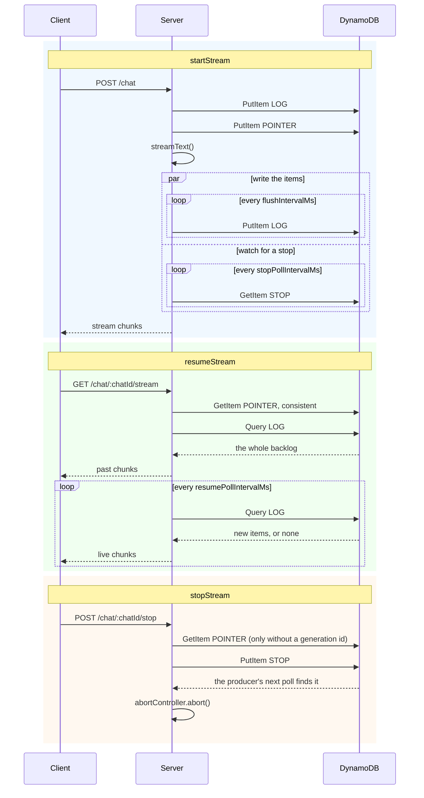

# DynamoDB adapter

The DynamoDB adapter stores each stream as a run of items in one DynamoDB table. A resume reads the chunks from the table. It does not need a response from the producing process, and any instance with access to the table can serve it.

```sh
npm install ai-resumable-stream @aws-sdk/client-dynamodb
```

## Table

The adapter does not create the table. It needs a table with a string partition key, a string sort key, and [time to live](https://docs.aws.amazon.com/amazondynamodb/latest/developerguide/TTL.html) enabled. The default attribute names are `pk`, `sk` and `expiresAt`, and you can change all three.

```ts
import {
  CreateTableCommand,
  DynamoDBClient,
  UpdateTimeToLiveCommand,
} from "@aws-sdk/client-dynamodb";

const client = new DynamoDBClient({ region: `us-east-1` });

await client.send(
  new CreateTableCommand({
    TableName: `streams`,
    AttributeDefinitions: [
      { AttributeName: `pk`, AttributeType: `S` },
      { AttributeName: `sk`, AttributeType: `S` },
    ],
    KeySchema: [
      { AttributeName: `pk`, KeyType: `HASH` },
      { AttributeName: `sk`, KeyType: `RANGE` },
    ],
    BillingMode: `PAY_PER_REQUEST`,
  }),
);

await client.send(
  new UpdateTimeToLiveCommand({
    TableName: `streams`,
    TimeToLiveSpecification: { AttributeName: `expiresAt`, Enabled: true },
  }),
);
```

The table can hold other data. All keys that the adapter writes begin with `prefix`.

## Example

You create the `DynamoDBClient`, so you control the credentials, the region and the retry behaviour.

```ts
import { DynamoDBClient } from "@aws-sdk/client-dynamodb";
import { streamText, toUIMessageStream, type UIMessage } from "ai";
import { createDynamoDBAdapter } from "ai-resumable-stream/adapters/dynamodb";
import { createResumableUIMessageStream } from "ai-resumable-stream/ai-sdk";

const context = createResumableUIMessageStream({
  adapter: createDynamoDBAdapter({
    client: new DynamoDBClient({ region: `us-east-1` }),
    tableName: `streams`,
  }),
});

// POST /chat/:chatId
export async function send(chatId: string, messages: Array<UIMessage>) {
  const abortController = new AbortController();

  const result = streamText({
    model: openai(`gpt-4o`),
    messages,
    abortSignal: abortController.signal,
  });

  const { stream } = await context.startStream(toUIMessageStream({ stream: result.stream }), {
    streamId: chatId,
    abortController,
  });

  return stream;
}

// GET /chat/:chatId/stream
export async function resume(chatId: string) {
  const stream = await context.resumeStream({ streamId: chatId });

  return stream ?? new Response(null, { status: 204 });
}

// POST /chat/:chatId/stop
export async function stop(chatId: string) {
  await context.stopStream({ streamId: chatId });
}
```

[`examples/dynamodb.ts`](../examples/dynamodb.ts) is a runnable example. It uses an in-memory table:

```sh
pnpm example:dynamodb
```

## Options

| Option                 | Type             | Default               | Description                                                                                         |
| ---------------------- | ---------------- | --------------------- | --------------------------------------------------------------------------------------------------- |
| `client`               | `DynamoDBClient` |                       | The DynamoDB client. You create and configure it                                                    |
| `tableName`            | `string`         |                       | The table that holds the streams                                                                    |
| `partitionKeyName`     | `string`         | `pk`                  | Attribute that holds the partition key of the table                                                 |
| `sortKeyName`          | `string`         | `sk`                  | Attribute that holds the sort key of the table                                                      |
| `ttlAttributeName`     | `string`         | `expiresAt`           | Attribute that time to live is configured on                                                        |
| `prefix`               | `string`         | `ai-resumable-stream` | Prefix of all partition keys that the adapter writes                                                |
| `flushIntervalMs`      | `number`         | `250`                 | Maximum time that chunks stay in memory before they are written                                     |
| `batchSize`            | `number`         | `50`                  | Number of buffered chunks that triggers a write                                                     |
| `resumePollIntervalMs` | `number`         | `500`                 | Interval at which a resumed stream checks for new chunks                                            |
| `stopPollIntervalMs`   | `number`         | `1000`                | Interval at which a producer checks for a stop request                                              |
| `heartbeatMs`          | `number`         | `5000`                | Interval at which an idle producer records that it is alive                                         |
| `deadAfterMs`          | `number`         | `30000`               | Time without writes after which a producer is considered dead. Must be at least twice `heartbeatMs` |
| `ttlSeconds`           | `number`         | `86400`               | Time after which an item expires. It bounds how long a stream can be replayed                       |

## How it works

A stream is a run of items in one partition. The adapter writes an item as chunks are produced. It buffers the chunks in memory and writes them when `batchSize` chunks are buffered or when `flushIntervalMs` has passed, whichever occurs first. A stream therefore costs one write per flush, not one write per chunk.

Each item has a sort key of `LOG#` and a sequence number. The number is zero-padded, because DynamoDB sorts keys as strings. The producer increases it only after a write succeeds, so the sequence has no holes. A reader stops at a sort key that is not the one it expects, instead of reading past it.

### Item size

An item holds at most 400 KB. The adapter keeps each item below that limit. If a single chunk is larger than one item, it is cut across several items on a UTF-8 boundary and joined again on read. A resumed stream therefore returns the chunks that the producer wrote, whatever their size.

### Generations

Each stream id has a pointer item that contains the id of the current generation. All other items, including the stop request, are in the partition of one generation. Therefore:

- a producer of an old generation cannot write into the partition of a newer generation
- a stop request only applies to the generation that it was written for

The stream id and the generation id are URL-encoded into the partition key, so an id that contains `#` cannot make one stream look like another. A generation id must not be empty.

The adapter writes the first item of a generation with a condition (`attribute_not_exists`). If that generation id already has items, the start fails with `ItemExistsError`. The adapter never overwrites items that a different producer can still write after.

### Resume

A resume without a generation id reads the pointer and then reads the partition of the generation that it points to. A resume with a generation id does not read the pointer. It reads that partition directly.

The backlog is read with strongly consistent queries, because an empty result is the answer: it is how an unknown stream is told apart from one that has only just started. After that, a resumed stream polls with eventually consistent queries, which cost half as much. A poll that is served stale data returns nothing and the next poll reads the same range again, so no chunk is lost.

### Stop

A stop request is also an item. `stopStream` writes it into the partition of the generation that you pass. Without a generation id, it writes into the partition that the pointer points to. The producer reads that item every `stopPollIntervalMs` and aborts its controller when it finds it.

The item stays in the table until it expires. If a stop request is written before its generation starts, the producer finds it when it starts.

### Storage layout

```
{prefix}#{streamId}                        POINTER      the generation that started last
{prefix}#{streamId}#{generationId}         LOG#…000     opens the generation
{prefix}#{streamId}#{generationId}         LOG#…001     chunks, or a heartbeat, or the end
{prefix}#{streamId}#{generationId}         STOP         stop request
```

`STOP` sorts after every `LOG#` key, so the range query that follows a stream never reads it.

The attributes of an item are single letters, because DynamoDB counts attribute names towards the size of every item:

| Attribute | Type               | Description                                            |
| --------- | ------------------ | ------------------------------------------------------ |
| `c`       | `List` of `String` | Chunk payloads                                         |
| `p`       | `Boolean`          | The last payload in `c` continues in the item after it |
| `e`       | `Boolean`          | The generation ended                                   |
| `t`       | `Number`           | Clock of the producer when it wrote the item           |
| `g`       | `String`           | Generation id. Pointer items only                      |
| `v`       | `Number`           | Format version. First item of a generation only        |

### Sequence diagram



### Cost

Each flush is one write request unit, for an item of up to 1 KB. These writes are the main cost of a stream, because a write request unit costs about five times a read request unit. A higher `flushIntervalMs` gives fewer writes, but a resumed stream is then further behind the producer.

A poll of a resumed stream is one eventually consistent query, which is half a read request unit even when it returns nothing. A resumed stream that waits therefore still costs one request per `resumePollIntervalMs`, and so does a producer that waits for a stop request.

All items of one generation share a partition key. A single stream is one partition, and DynamoDB limits a partition to 1000 write request units per second, which is far above what a flush interval of 250ms produces. Many streams spread over many partitions, because the stream id is part of the key.

### Liveness

When a producer has no chunks to write, it writes a heartbeat item every `heartbeatMs`. If a generation has no writes for `deadAfterMs`, the adapter considers the producer dead. `resumeStream` then returns `null`, and a resumed stream that already reads the generation ends.

> [!NOTE]
> DynamoDB returns no clock of its own, so a resume compares the clock of the reader with the clock of the producer, which is written into each item. Hosts whose clocks are far apart disagree about when a stream went quiet. The S3 Express adapter does not have this problem, because S3 returns its own clock with every response.

### Cleanup

The adapter does not delete items when a stream finishes, because a resumed stream can still read them. Every item that it writes gets an expiry of `ttlSeconds`, and the time to live of the table removes it. `ttlSeconds` therefore bounds how long a finished stream can still be replayed.

> [!WARNING]
> DynamoDB deletes expired items within a few days of their expiry, not at the moment of it. Do not rely on the expiry to hide a stream. It keeps the table from growing forever, nothing more.
