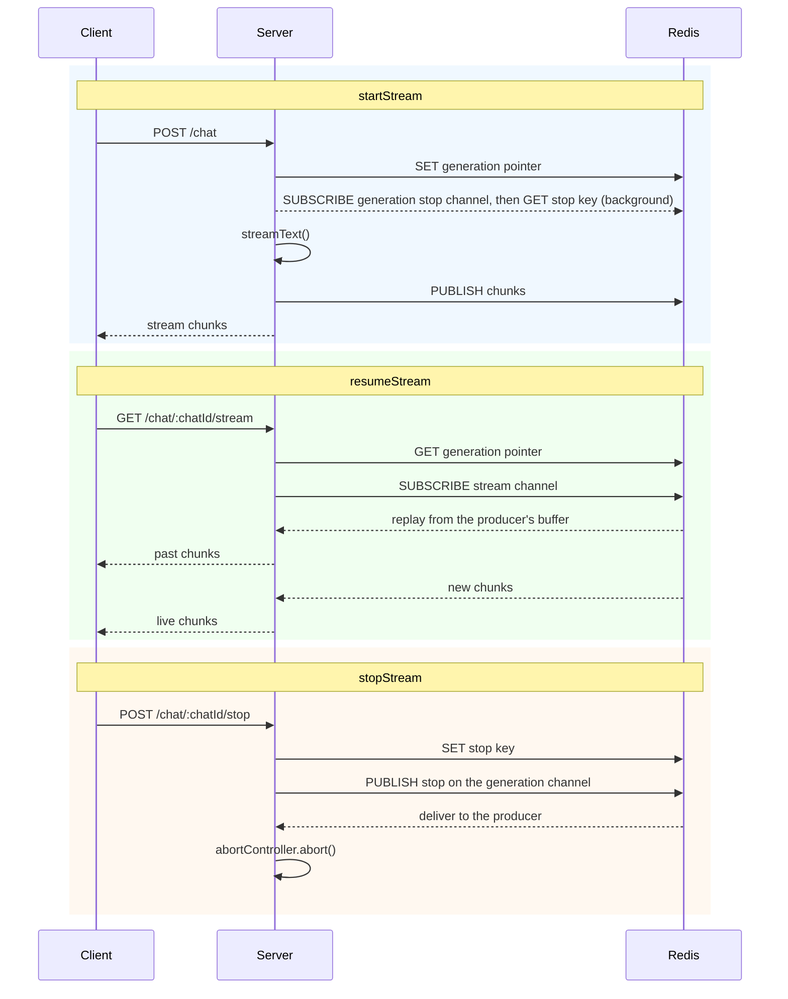

# Redis adapter

The Redis adapter keeps the chunks in the memory of the producing process. Redis only transports messages and stores a few small keys per stream. Redis never stores the chunks.

```sh
npm install ai-resumable-stream redis
```

Both `redis` v5 and v6 are supported.

## Example

The adapter requires two Redis clients, because a subscribed connection cannot send commands. The library connects the clients if they are not connected yet, but it never disconnects them. You manage the connection lifecycle in your application and can reuse the clients for all streams.

```ts
import { streamText, toUIMessageStream, type UIMessage } from "ai";
import { createClient } from "redis";
import { createRedisAdapter } from "ai-resumable-stream/adapters/redis";
import { createResumableUIMessageStream } from "ai-resumable-stream/ai-sdk";

// Important: publisher and subscriber must be separate clients
const publisher = createClient({ url: process.env.REDIS_URL });
const subscriber = createClient({ url: process.env.REDIS_URL });

const context = createResumableUIMessageStream({
  adapter: createRedisAdapter({ publisher, subscriber }),
});

// POST /chat/:chatId
export async function send(chatId: string, messages: Array<UIMessage>) {
  const abortController = new AbortController();

  const result = streamText({
    model: openai(`gpt-4o`),
    messages,
    abortSignal: abortController.signal,
  });

  const { stream } = await context.startStream(toUIMessageStream({ stream: result.stream }), {
    streamId: chatId,
    abortController,
  });

  return stream;
}

// GET /chat/:chatId/stream
export async function resume(chatId: string) {
  const stream = await context.resumeStream({ streamId: chatId });

  return stream ?? new Response(null, { status: 204 });
}

// POST /chat/:chatId/stop
export async function stop(chatId: string) {
  await context.stopStream({ streamId: chatId });
}
```

[`examples/redis.ts`](../examples/redis.ts) is a runnable example. It starts a temporary Redis server:

```sh
pnpm example:redis
```

## Options

| Option       | Type          | Required | Description                                                                                               |
| ------------ | ------------- | -------- | --------------------------------------------------------------------------------------------------------- |
| `publisher`  | `RedisClient` | Yes      | Client that sends commands and publishes messages                                                         |
| `subscriber` | `RedisClient` | Yes      | Client for subscriptions. Must be a separate client, because a subscribed connection cannot send commands |
| `keyPrefix`  | `string`      | No       | Prefix for all keys and channels. Defaults to `ai-resumable-stream`                                       |

## How it works

This adapter is built on [`resumable-stream`](https://github.com/vercel/resumable-stream). Redis does not store the chunks. The chunks stay in the memory of the producing process. When a client resumes, the producer sends the chunks to it over pub/sub. Redis only transports messages and stores a few small keys per stream. You do not need to configure chunk retention.

> [!IMPORTANT]
> **A stream is only resumable while its producer is alive.**

### Pointer

Each stream id has a pointer key that contains the id of the current generation. When you start a stream with a stream id that is already in use, the pointer changes to the new generation.

When the source stream of a generation ends, the generation deletes the pointer immediately, but only if the pointer still points to that generation. An old generation therefore cannot delete the pointer of a newer generation. A resume request that arrives while the generation shuts down returns `null`.

The pointer expires after 24 hours. If a producer dies without cleanup, the key does not stay in Redis for longer than that.

### Resume

A resume without a generation id reads the pointer and resumes the generation that it points to.

A resume with a generation id does not read the pointer. It requests that generation directly. This also works after a newer generation has started, as long as the producer of the requested generation is alive.

### Stop

Each generation has its own pub/sub channel for stop requests. When a stream starts, the producer subscribes to the channel of its generation. When a message arrives, the producer aborts its controller. It does not matter which process published the message. Because each generation has its own channel, the end of one generation does not remove the listener of a different generation on the shared subscriber connection.

Pub/sub does not store messages. A stop request that is published before the producer has subscribed would be lost. The adapter therefore also stores the stop request in a key:

1. `stopStream` sets a stop key for the generation (it expires after one hour) and then publishes the message.
2. The producer subscribes to the channel and then reads the stop key.

In both orders, the producer gets the stop request, from the subscription or from the key.

A stop request without a generation id is stored for the generation that the pointer points to at that time. If there is no current generation, nothing is stored.

When a generation ends, it deletes its stop key together with the pointer. A stop request therefore does not stay in Redis after its generation has ended. The one hour expiry only applies to a stop request for a generation that never started, or for a generation whose producer died before cleanup.

### Reused generation ids

A generation id must be unique within its stream id. This adapter does not check this. If you start a second generation with a generation id that was used before:

- both producers answer the same resume requests
- the generation that ends first makes the other generation impossible to resume
- one stop request stops both generations

### Sequence diagram


