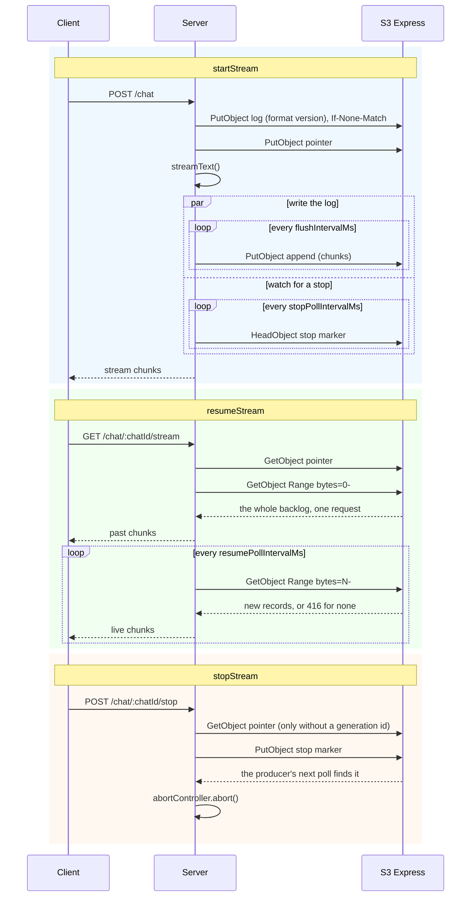

# S3 Express adapter

The S3 Express adapter stores each stream as one appendable object in an [S3 Express One Zone](https://docs.aws.amazon.com/AmazonS3/latest/userguide/s3-express-one-zone.html) directory bucket. A resume reads the chunks from the object. It does not need a response from the producing process, and any instance with access to the bucket can serve it.

```sh
npm install ai-resumable-stream @aws-sdk/client-s3
```

> [!IMPORTANT]
> The bucket must be an [S3 Express One Zone](https://docs.aws.amazon.com/AmazonS3/latest/userguide/s3-express-one-zone.html) directory bucket in an Availability Zone. Only directory buckets support appends to an object. The adapter uses appends to store a stream as one object instead of one object per batch.

## Example

You create the `S3Client`, so you control the credentials, the region and the retry behaviour.

```ts
import { S3Client } from "@aws-sdk/client-s3";
import { streamText, toUIMessageStream, type UIMessage } from "ai";
import { createS3ExpressAdapter } from "ai-resumable-stream/adapters/s3-express";
import { createResumableUIMessageStream } from "ai-resumable-stream/ai-sdk";

const context = createResumableUIMessageStream({
  adapter: createS3ExpressAdapter({
    client: new S3Client({ region: `us-east-1` }),
    bucket: `my-streams--use1-az4--x-s3`,
  }),
});

// POST /chat/:chatId
export async function send(chatId: string, messages: Array<UIMessage>) {
  const abortController = new AbortController();

  const result = streamText({
    model: openai(`gpt-4o`),
    messages,
    abortSignal: abortController.signal,
  });

  const { stream } = await context.startStream(toUIMessageStream({ stream: result.stream }), {
    streamId: chatId,
    abortController,
  });

  return stream;
}

// GET /chat/:chatId/stream
export async function resume(chatId: string) {
  const stream = await context.resumeStream({ streamId: chatId });

  return stream ?? new Response(null, { status: 204 });
}

// POST /chat/:chatId/stop
export async function stop(chatId: string) {
  await context.stopStream({ streamId: chatId });
}
```

[`examples/s3-express.ts`](../examples/s3-express.ts) is a runnable example. It uses an in-memory bucket:

```sh
pnpm example:s3-express
```

## Options

| Option                 | Type       | Default               | Description                                                                                         |
| ---------------------- | ---------- | --------------------- | --------------------------------------------------------------------------------------------------- |
| `client`               | `S3Client` |                       | The S3 client. You create and configure it                                                          |
| `bucket`               | `string`   |                       | A directory bucket in an Availability Zone                                                          |
| `prefix`               | `string`   | `ai-resumable-stream` | Prefix for all keys. Use it as the filter of the lifecycle rule                                     |
| `flushIntervalMs`      | `number`   | `250`                 | Maximum time that chunks stay in memory before they are written                                     |
| `batchSize`            | `number`   | `50`                  | Number of buffered chunks that triggers a write                                                     |
| `resumePollIntervalMs` | `number`   | `500`                 | Interval at which a resumed stream checks for new chunks                                            |
| `stopPollIntervalMs`   | `number`   | `1000`                | Interval at which a producer checks for a stop request                                              |
| `heartbeatMs`          | `number`   | `5000`                | Interval at which an idle producer records that it is alive                                         |
| `deadAfterMs`          | `number`   | `30000`               | Time without writes after which a producer is considered dead. Must be at least twice `heartbeatMs` |

## How it works

A stream is one object in the bucket. The adapter appends to the object as chunks are produced. It buffers the chunks in memory and writes them when `batchSize` chunks are buffered or when `flushIntervalMs` has passed, whichever occurs first. A stream therefore costs one request per flush, not one request per chunk.

### Generations

Each stream id has a pointer object that contains the id of the current generation. All other keys that the adapter writes, including the stop marker, are below the path of one generation. Therefore:

- a producer of an old generation cannot append to the log of a newer generation
- a stop request only applies to the generation that it was written for

A generation id that you pass is URL-encoded into one path segment, the same as the stream id. It must not be empty, `.`, `..` or `current`, because `current` is the name of the pointer object.

The adapter creates the log object of a generation with a conditional write (`If-None-Match: *`). If a log for that generation id already exists, the start fails with `ObjectExistsError`. The adapter never overwrites a log that a different producer can still append to.

### Resume

A resume without a generation id reads the pointer and then reads the log of the generation that it points to. A resume with a generation id does not read the pointer. It reads the log of that generation directly.

### Stop

A stop request is also an object. `stopStream` writes a stop marker below the generation that you pass. Without a generation id, it writes the marker below the generation that the pointer points to. The producer checks for the marker every `stopPollIntervalMs` and aborts its controller when it finds the marker.

The marker stays in the bucket. If a stop request is written before its generation starts, the producer finds the marker when it starts.

### Storage layout

The log is one appendable object. It contains the chunks, the heartbeats of the producer and an end record. A resumed stream reads all existing data with one ranged read. It then reads new data with one request per poll.

```
{prefix}/{streamId}/current                pointer to the generation that started last
{prefix}/{streamId}/{generationId}/0       the log
{prefix}/{streamId}/{generationId}/stop    stop marker
```

### Sequence diagram



### Cost

Each flush is one billed `PutObject` request. These writes are the main cost of a stream. A higher `flushIntervalMs` gives fewer writes, but a resumed stream is then further behind the producer. Reads cost much less than writes. Run the producer in the same Availability Zone as the bucket, because AWS documents that access from a different zone is slower.

### Liveness

When a producer has no chunks to write, it writes a heartbeat every `heartbeatMs`. The adapter uses the clock of S3, not the local clock, to check if a producer is alive. If a log has no writes for `deadAfterMs`, the adapter considers the producer dead. `resumeStream` then returns `null`, and a resumed stream that already reads the log ends.

### Cleanup

The adapter does not delete objects when a stream finishes, because a resumed stream can still read them. Set a [lifecycle expiration rule](https://docs.aws.amazon.com/AmazonS3/latest/userguide/directory-buckets-objects-lifecycle.html) on the bucket with `prefix` as the filter.

> [!WARNING]
> A lifecycle rule on a directory bucket only works if the bucket policy grants `s3express:CreateSession` with `ReadWrite` to `lifecycle.s3.amazonaws.com`. Without this grant, the rule does nothing, AWS shows no error, and the objects are never deleted.
